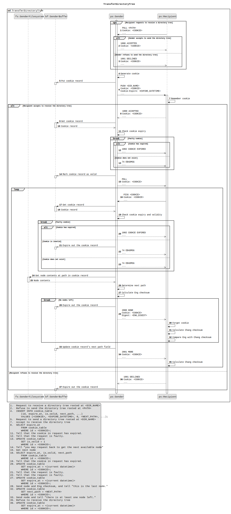

# Pastree

**Pastree** is a client-server based directory storing and sharing service
(directory pastebin) written in C and Python.

> [!NOTE]  
> This is a student project, **but contributions are welcomed**!  
> 01418351: Computer Communications and Cloud Computing Principles

Pastree uses the **Directory Exchange Protocol (DXP)** for reading,
exchanging, and forming directory trees between hosts.

## Student Author

**Potsawat Thinkanwatthana**  
B.S. in Computer Science  
Kasetsart University, Bangkok, Thailand.

## Repositories

There are two repositories:

- Pastree Server <https://github.com/naiithink/pastree-server>
- Pastree Client <https://github.com/naiithink/pastree-client>

## **Directory Exchange Protocol (DXP)**

DXP Repository: [github.com/naiithink/dxp](https://github.com/naiithink/dxp)

## Interactions

## Source Code

Some of the code and concepts are based on my "trials and errors" and side projects.

### DXP Library Draft

[github.com/naiithink/dxp/ab380e8: /lib/](https://github.com/naiithink/dxp/tree/ab380e8e7c7c408f940f3b14cdd1a055ab6cb6cf/lib)

### Network Programming and Basic Security Concepts

- ["Casting malloc," cprogramming.com](https://faq.cprogramming.com/cgi-bin/smartfaq.cgi?answer=1047673478&id=1043284351)
- [github.com/naiithink/ku-bs-cs/main: /Y1-02/01418113/](https://github.com/naiithink/ku-bs-cs/tree/main/Y1-02/01418113)
- [github.com/naiithink/learn](https://github.com/naiithink/learn/)
    - [learn-cc: /src/sockets](https://github.com/naiithink/learn/tree/learn-cc/src/sockets)
    - [main: /learn/c/](https://github.com/naiithink/learn/tree/main/learn/c)
    - [main: /learn/compilation/c/](https://github.com/naiithink/learn/tree/main/learn/compilation/c)
    - [main: /learn/cs/network/](https://github.com/naiithink/learn/tree/main/learn/cs/network)
    - [main: /learn/cs50/c/](https://github.com/naiithink/learn/tree/main/learn/cs50/c)
    - [main: /learn/cython/](https://github.com/naiithink/learn/tree/main/learn/cython)
    - [main: /learn/dev/](https://github.com/naiithink/learn/tree/main/learn/dev)
    - [main: /learn/execution/c/](https://github.com/naiithink/learn/tree/main/learn/execution/c)
    - [main: /learn/forking/](https://github.com/naiithink/learn/tree/main/learn/forking)
    - [main: /security/c/](https://github.com/naiithink/learn/tree/main/security/c)
    - [main: /zlambda/C/](https://github.com/naiithink/learn/tree/main/zlambda/C)

### Tree Traversal

[github.com/naiithink/try-xml](https://github.com/naiithink/try-xml)

### Command Line Interface

- [Isam, Mohammed, "Let's Build a Linux Shell [Part I]," hackernoon.com](https://hackernoon.com/lets-build-a-linux-shell-part-i-bz3n3vg1)
- [github.com/naiithink/learn](https://github.com/naiithink/learn/)
    - [main: /playgrounds/yep/](https://github.com/naiithink/learn/tree/main/playgrounds/yep)
    - [main: /playgrounds/legacy-yep/](https://github.com/naiithink/learn/tree/main/playgrounds/legacy-yep)
- [github.com/naiithink/try-glab-cicd](https://github.com/naiithink/try-glab-cicd)

## Huge Thanks to:

- [CS50 2022](https://cs50.harvard.edu/x/2021/)
- [youtube.com/@JacobSorber](https://www.youtube.com/@JacobSorber)

## Contributing

Although this is a student project, **any contribution is appreciated**.

## License

Code is under the [MIT License](LICENSE).
Documentation is under the [Creative Commons Attribution license](https://creativecommons.org/licenses/by/4.0/).
